# Project 1: ATX Bench Power Supply

## 1. Project Summary & Requirements
* **Project Revision:** v1.0
* **Team Members:** 
  - Wuttiworakij Tubtim 6809098660136
  -  Natchanon Marius Kuersteiner 6809098660101
* **Source PSU Make/Model:** Plenty computer power supply ATX500ws
* **Project Summary:** Conversion of a closed-case PC ATX power supply into a safe bench power source providing fixed rails and an adjustable output using external low-voltage circuits.
* **Accepted Requirements:** 
  * Provide available +3.3 V, +5 V, +12 V, and -12 V rails on labelled binding posts.
  * Separate approved fuse in every accessible non-COM output branch.
  * Include an adjustable buck-boost module.
  * Provide insulated PS_ON control and state indication.

## 2. Safety & Risk Management
* **Safety Boundary:** The ATX case remains closed at all times. All wiring changes are performed with the AC cable physically removed.
* **Risk Assessment:** Key risks include accidental short circuits, improper fuse selection, and thermal overload. Mitigated by strict branch fusing and enclosed external wiring.
* **Stop Conditions:** Immediately halt testing and remove AC if there is unstable rail voltage, unexpected current, blown fuses, unusual odors, or excessive temperatures.

## 3. Source PSU Documentation
* **Label Transcription:** 
  * Max Combined Power: 500W
  * +3.3V: 22A | +5V: 14A | +12V: 14A | -12V: 0.8A | +5VSB: 2.5A
* **Verified Connector View:** 
  * 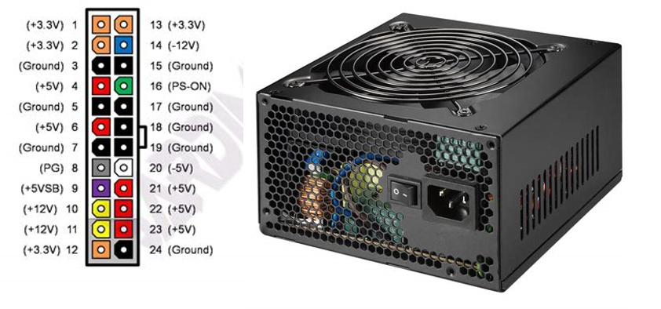
* **Source Links:** https://docs.cirkitdesigner.com/component/1ce54fb2-2242-415e-a64d-dcc2a715ca80/atx-power-supply

## 4. Schematics & Enclosure Plan
* **Final As-Built Schematic:** 
   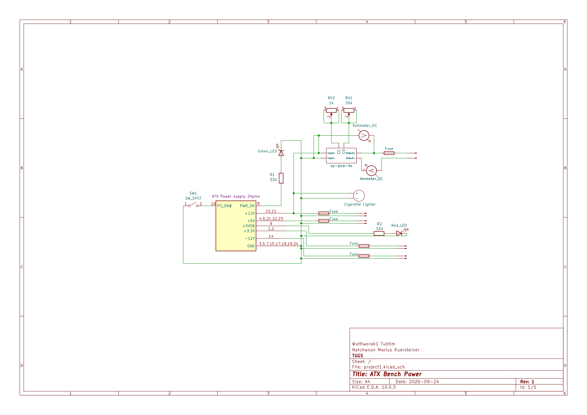
* **Front-Panel/Enclosure Drawing:** 
    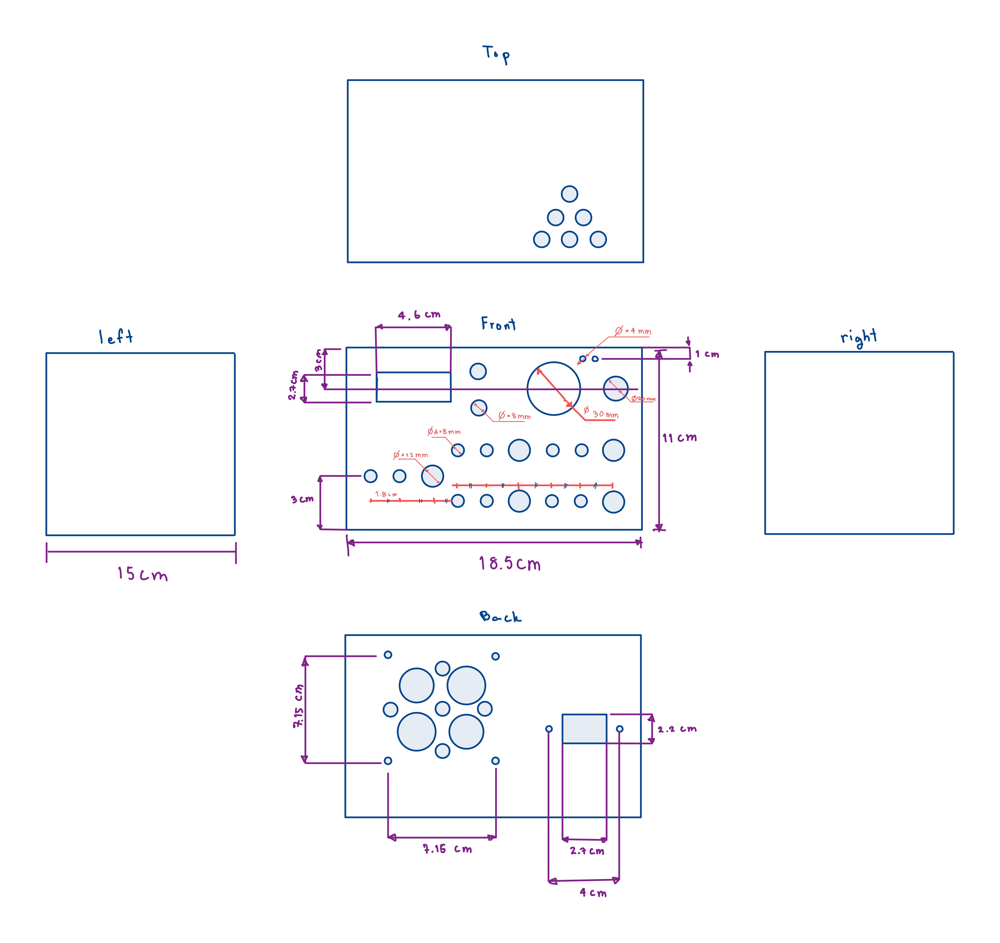

## 5. Bill of Materials (BOM)

| Identifier | Description / Rating | Datasheet Link/source | Cost |
| :---: | :---: | :---: | :---: |
| F1-F5 | Inline Fuse Holders & fuses | https://www.farnell.com/datasheets/1504744.pdf | ฿50 |
| SW1 | Maintained SPST Switch | [Source](https://shopee.co.th/product/95412026/22911608775?gads_t_sig=gqRjZGVrxHCFomtpsTE0MjUxOnRzc19zZGtfa2V5omt20QACpGFsZ2_SAAAAZKNkZWvAomN0xEAAAAAMCDZ1QISG3Y9eQ8yPVgAOiad7g2PqyaqkWO_9nGG8rv2GeSvTKVy0YH9Uq_tAMSkaB8ROm0FmD1_y4Fc6qmNpcGhlcnRleHTEbwAAAAzAgpE-EA_0FzPepYtwuIiDe5r3g45WSKiGm_ijqcDyyayqR6DZrNQZAU37Uj78mwqaJtFpuoYF4-DrAsKCAYuS8czYPt5-L2T58ffCfbGpIuozb5lgBT0ncLWviTRm8zjEb2hqlRg7qAE7Nw&gad_source=1&gad_campaignid=24147746763&gbraid=0AAAAADPpYO1otLBN7AT7b5fDJTmfWNGTE&gclid=Cj0KCQjwt9jVBhDXARIsAFSP-6dSEpeBulUAbj9B710xY5rXO1PuFQ4Pj_rzTXKHDDVpfvqSiUb8dbgaAndtEALw_wcB) | ฿20 |
| MOD1 | Buck-Boost Converter (0-30 V) | https://manuals.plus/ae/1005005746706715 |  ฿100 |
| TERM | Insulated Binding Posts | [Source](https://shopee.co.th/product/117987364/21090399403?gads_t_sig=gqRjZGVrxHCFomtpsTE0MjUxOnRzc19zZGtfa2V5omt20QACpGFsZ2_SAAAAZKNkZWvAomN0xEAAAAAMCDZ1QISG3Y9eQ8yPVgAOiad7g2PqyaqkWO_9nGG8rv2GeSvTKVy0YH9Uq_tAMSkaB8ROm0FmD1_y4Fc6qmNpcGhlcnRleHTEcQAAAAyq6aULE1zNBGFEF7N91QzBaFlQ41ZRP66AIVECF7NPQtRFxZFpf8bfYHhIXAzTWTIhGwCx2xKvTrfUrjWigW5CBuoBVmI1lbGE53if1GfpzMd_tUQjNg7X4aobn47lAjW_qJBLjX_XpSntpLCk&gad_source=1&gad_campaignid=22776277884&gbraid=0AAAAADPpYO1Gt-NhLi2rXShAXnzGtOtpM&gclid=Cj0KCQjwt9jVBhDXARIsAFSP-6cQ_E5DEEVts_G0BbnBTXM8C4woc_I_rqyyg3gmC6B5lvPFqJ1Qp3oaAhmHEALw_wcB)| ฿75|
| METER | Volt and Ampere meter | https://curtocircuito.com.br/datasheet/modulo/voltimetro_e_amperimetro.pdf?srsltid=AU7gw4W9mmdsUSJkVXkONQ-hMopGn3YJp837C4u4a39ARRWwX-ZoSkOt | ฿40 |
| Power Outlet | 12V Accessory Socket | [Source](https://shopee.co.th/product/1136055980/29381265984?gads_t_sig=gqRjZGVrxHCFomtpsTE0MjUxOnRzc19zZGtfa2V5omt20QACpGFsZ2_SAAAAZKNkZWvAomN0xEAAAAAMCDZ1QISG3Y9eQ8yPVgAOiad7g2PqyaqkWO_9nGG8rv2GeSvTKVy0YH9Uq_tAMSkaB8ROm0FmD1_y4Fc6qmNpcGhlcnRleHTEcwAAAAxeypaDgCckE46rxgfC9GxLCTvZmsmSOjRl_ODriKUClBi1k83kaN-s8_f7rXVOvlQLvN4tIBdB6EKJ7QLkn-7nBRPJ9rocn9vANDWqZZnp5rQV1rB2714yFH8cBtQh0vxpiaW6L7FwudV4x4lo7VA&gad_source=1&gad_campaignid=17494379724&gbraid=0AAAAADPpYO2-C8yPQvGf_KAOtep-T6cR5&gclid=Cj0KCQjwt9jVBhDXARIsAFSP-6ddHJRkQlEOjZbMpt9Tms_CuIHNrRLYQohHDbSkjig-RwOaNg6lB3caAkTAEALw_wcB) | ฿30 |

## 6. Engineering Calculations
* **Branch-Protection:** Inline fast-blow fuses were selected to protect both the external wiring and the binding posts. The +3.3 V, +5 V, and +12 V rails are fused at 10 A to prevent terminal melting. The -12 V rail is fused at 0.5 A to protect the sensitive 0.8 A source limit.
* **Conductor Sizing:** The internal ATX wiring use standard 18 AWG stranded copper wire. A 18 AWG chassis wiring is rated for a maximum of 16 A. By limiting the main rails to 10 A via fuses.the conductors operate safely within their thermal ampacity limits with an adequate safety margin.
* **Converter Input Current Estimate:** The buck-boost module (fed by the +12 V rail) steps voltage up or down. Assuming a worst-case scenario where the user requests 24 V at 1.5 A with a typical module efficiency ($\eta$) of 85%:

$$I_{in} \approx \frac{V_{out}I_{out}}{\eta V_{in}}$$
$$I_{in} \approx \frac{24 \times 1.5}{0.85 \times 12} \approx 3.53 \text{ A}$$

* **Thermal & Loss:** Assuming a slightly degraded contact resistance of $0.01\ \Omega$ at the binding posts, the power dissipation at a maximum sustained load of 10 A is calculated as:

$$P_{loss} = I^2R$$
$$P_{loss} = 10^2 \times 0.01 = 1 \text{ W}$$

## 7. Construction Photographs
* **Internal Wiring:** 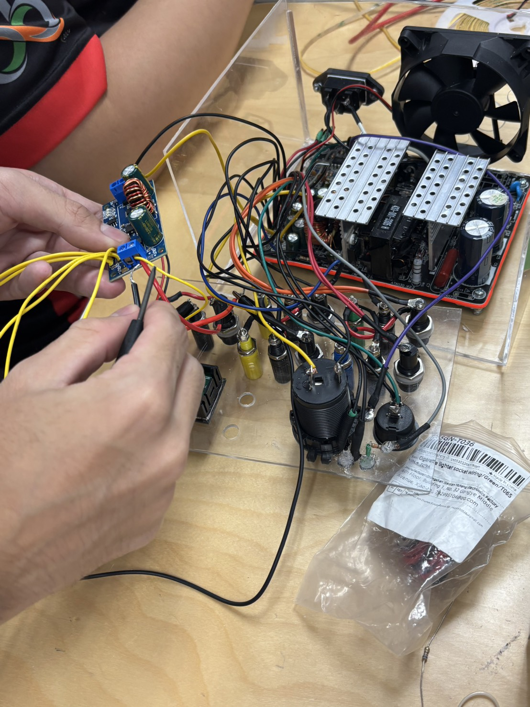
* **Insulation & Restraint:** 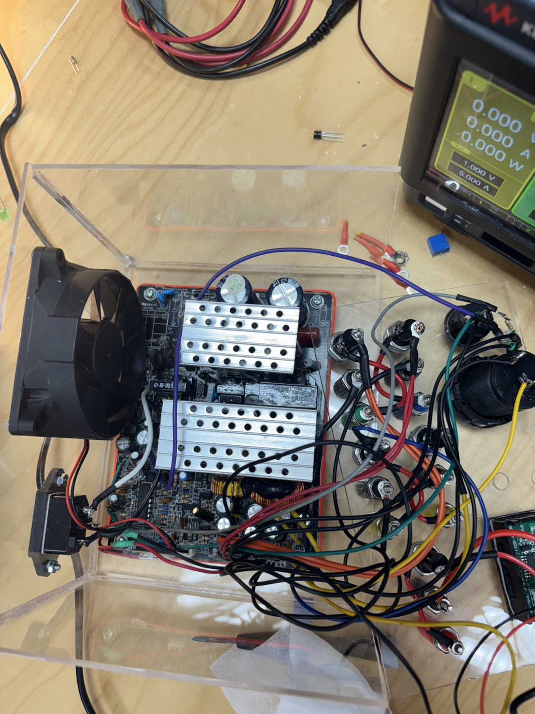
* **Soldering and Assemble:** 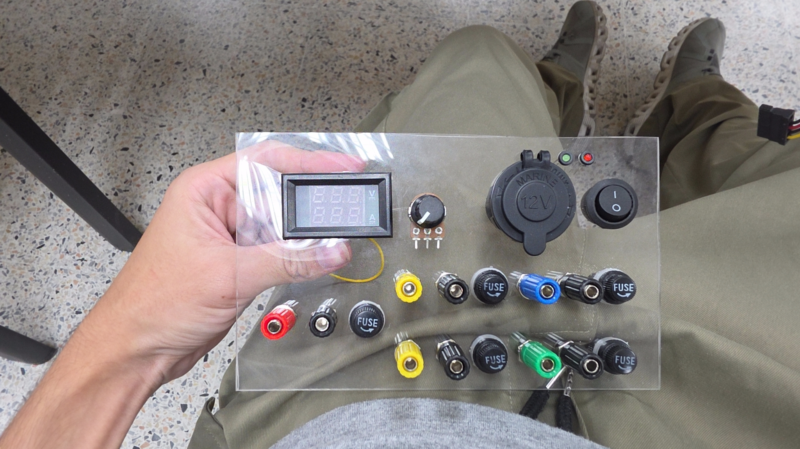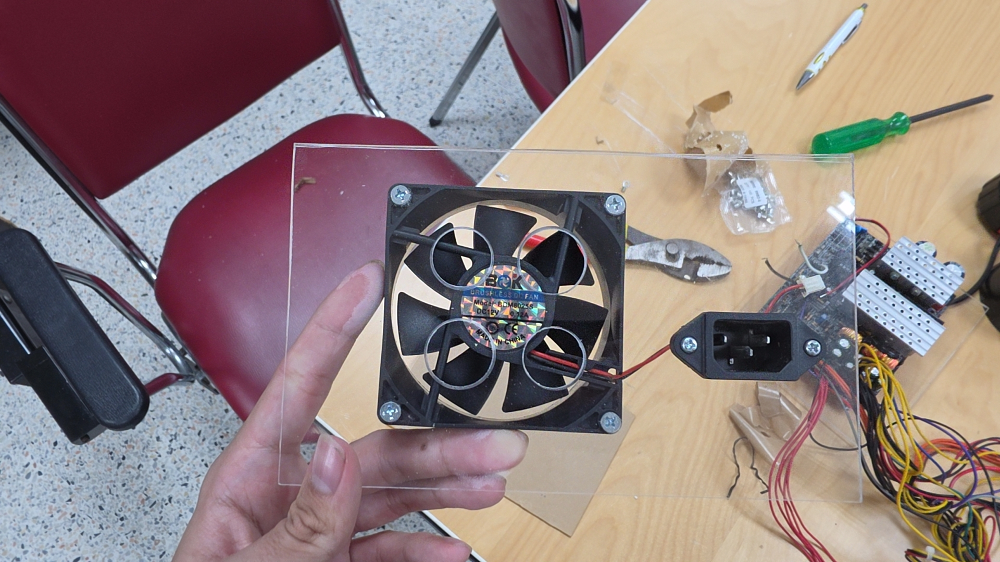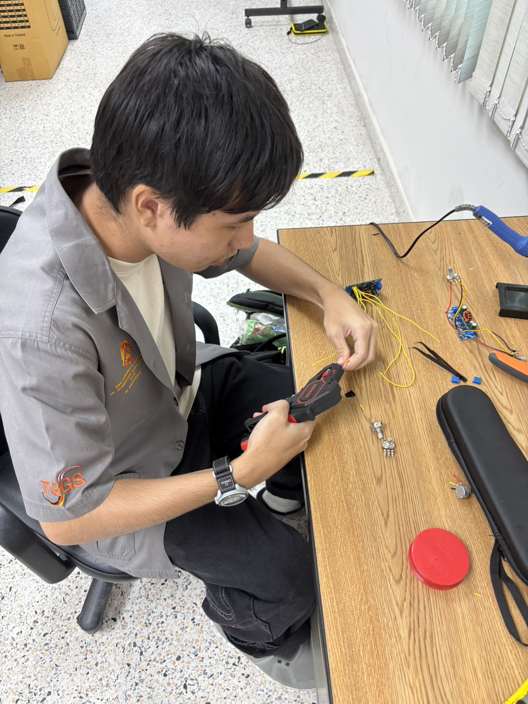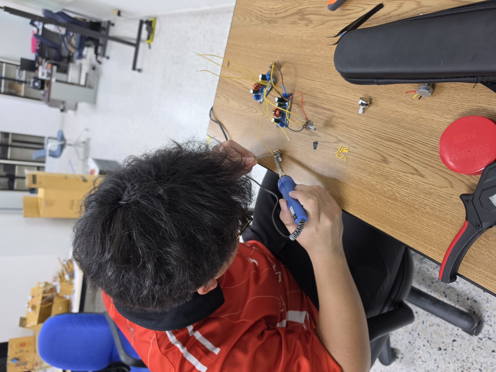
* **Finished Product:** 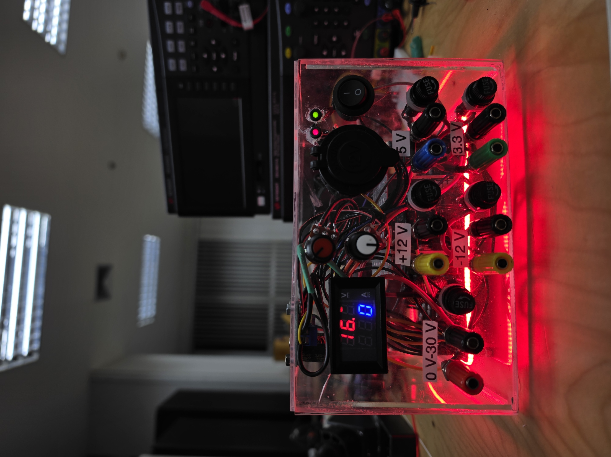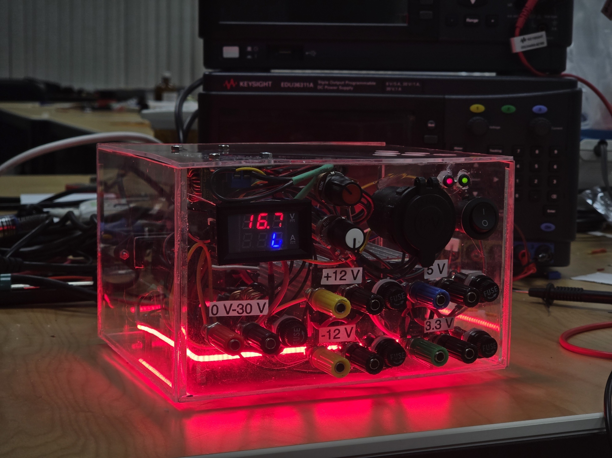

## 8. Test Evidence & Measurements
* **Minimum-Load Decision:** The Plenty ATX500ws power supply does not require a high-wattage external dummy load to initialize or maintain voltage regulation. The internal switching circuitry, combined with the small quiescent current draw from the digital panel meters and the buck-boost converter, provides sufficient base load to keep the switch-mode power supply (SMPS) stable.
* **Testing:**

| Rail | No-Load V | 
| :---: | :---: | 
| +3.3V| 3.394V| 
| +5V | 5.106V| 
| +12V | 12.27V| 
| -12V |-11.74V | 
| 0-30V |min:0.5V, Max:~30|

## 9. Fault Log & Diagnostics

| Symptom / Fault | Diagnostic Evidence | Correction Applied | Retest Result |
| :---: | :---: | :---: | :---: |
| The voltmeter isn't showing any value | Under no-load conditions with the xy-sjva-4x to mains power, a digital multimeter set to DC voltage recorded 0.00V |First we change the xy-sjva-4x but the problem still occur so we change the potentiometer | The voltmeter show as intended |

## 10. Operating Instructions & Maintenance
* **Startup Procedure:** 
  1. Ensure main toggle is OFF. 
  2. Connect loads to appropriate terminals. 
  3. Plug in AC cable. 
  4. Flip main toggle to request main rails.
* **Shutdown & Storage:** Turn off main toggle, remove AC, and allow capacitors to discharge before removing external leads.
* **Limitations:** Do not exceed 5 Amps on the adjustable rail. The -12V rail is limited to 0.8 Amps.
* **Fuse Replacement:** Disconnect AC. Open inline fuse holders and replace only with 10 A for the +3.3 V, +5 V, and +12 V rails, and 0.5 A for the -12 V rail fuses.

## 11. Individual Contributions
* **Wuttiworakij:** Soldered electrical parts, cut and assemble the case of ATX-power supply, presentation.
* **Natchanon:** Schematic design, case design, soldered electrical parts, assemble parts, documents.

## 12. References
* 03_project01.pdf
* https://www.electronics-tutorials.ws/blog/convert-atx-psu-to-bench-supply.html